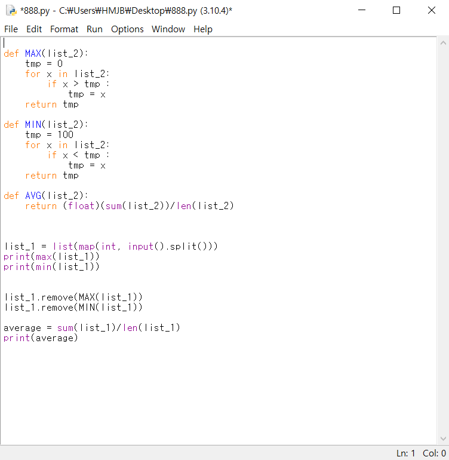
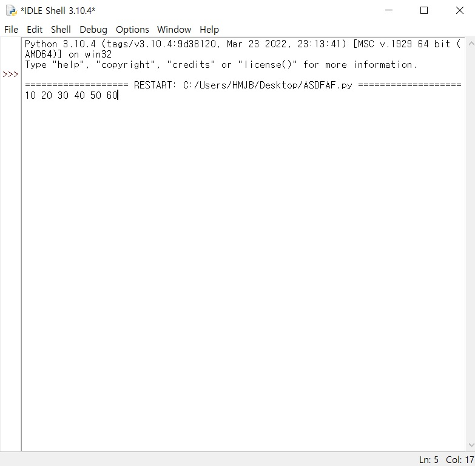
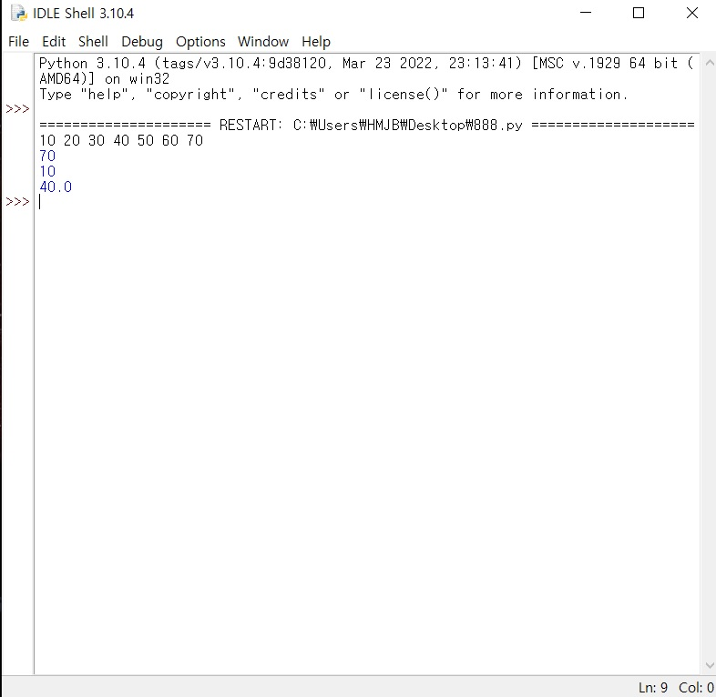

About
=============
This program is a calculator that calculates the maximum, minimum, and average.

List of Features
======
* Maximum value function
* Minimum value function
* Average value function

How to Use the Program
=======
1. Copy this code and paste it into the program.
2. Enter the number you want.
3. Run a program.

Description of Example Runs
=======
1.Copy this code and paste it into the program.

</image>

2.Enter the number you want.

</image>

3.Run a program.

</image>

4.Check if it comes out normally.

